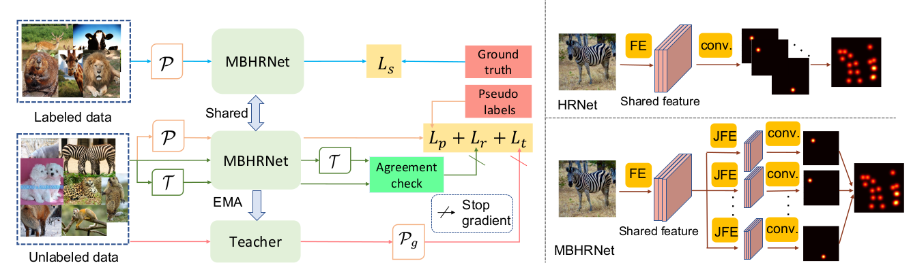

# ScarceNet

**About**

This is the source code for our paper

Chen Li, Gim Hee Lee. ScarceNet: Animal Pose Estimation with Scarce Annotations. In CVPR 2023.

In this paper, we aim to achieve accurate animal pose estimation with only a small set of labeled images and unlabeled images. 

<p align="center">
  
</p>

We design a pseudo label based framework to learn from scarce animal pose data. We first apply the small-loss trick to select a set of reliable pseudo labels. Despite its effectiveness, pseudo label selection by the small-loss trick tends to discard numerous high-loss samples. This results in high
wastage since those discarded samples can still provide extra information for better discrimination. In view of this, we propose a reusable sample re-labeling step to further identify reusable samples from the high-loss samples via an agreement check and re-generate the corresponding pseudo labels for supervision. Lastly, we design a student-teacher framework to enforce consistency between the outputs of the student and teacher network.

<p align="center">
  
</p>

For more details, please refer to [our paper](http://arxiv.org/abs/2303.15023).

**Dependencies**
1. Python 3.7
2. Pytorch 1.7

Please refer to requirements.txt for more details on dependencies.

**Download datasets**

* Clone this repository:

    ```
    https://github.com/chaneyddtt/ScarceNet.git
    ```
* Download the [AP10K dataset](https://github.com/AlexTheBad/AP-10K). Put the data and annotations under root/data/animalpose/.
* Download the [HRNet](https://github.com/leoxiaobin/deep-high-resolution-net.pytorch) pretrained on the imagenet, and put under root/models/.

**Test**

Download [our models](https://drive.google.com/file/d/1MQGyyf1MQjETRG_CRBMEfrV0IFiis_ZQ/view?usp=share_link) and put them under the root/output folder. Test for the semi-supervised setting by running the command below.  (We provide models trained with 5, 10, 15, 20 and 25 labels per category)
```
CUDA_VISIBLE_DEVICES=0 python tools/test.py --cfg experiments/ap10k/hrnet/w32_256x192_adam_lr1e-3.yaml --animalpose OUTPUT_DIR test TEST.MODEL_FILE output/output_part5_updatev2/model_best.pth MODEL.NAME pose_hrnet_part GPUS [0,]
```
You can also test for the transfer learning setting by running (modify DATASET.SUPERCATEGORY to test on different animal categories):
```
CUDA_VISIBLE_DEVICES=0 python tools/test.py --cfg experiments/ap10k/hrnet/w32_256x192_adam_lr1e-3.yaml --animalpose OUTPUT_DIR test TEST.MODEL_FILE output/output_part_updatev2_transfer/model_best.pth MODEL.NAME pose_hrnet_part GPUS [0,] DATASET.DATASET ap10k_test_category DATASET.SELECT_DATA True DATASET.SUPERCATEGORY "'deer',"
```

**Train**

If you do not want to train from scratch, you can download [the models](https://drive.google.com/file/d/1Cel43-6dzj4o9xBIXa_cBsZcvvht5Uoz/view?usp=share_link) trained with the few labeled animal data, as well as the corresponding [pseudo labels](https://drive.google.com/file/d/152_mFWBO2Scc7MhcnsSWPnrCn4RsdhQX/view?usp=share_link) generated by these models. Move the folder pseudo labels under root/data/ and the pretrained models under root/output/. Train our model by running the command below. You can change the number of labels by setting 'LABEL_PER_CLASS' to 5, 10, 15, 20, 25 respectively. The pretrained model and output directory need to be changed acoordingly.
```
CUDA_VISIBLE_DEVICES=0,1 python tools/train_mt_part.py --cfg experiments/ap10k/hrnet/w32_256x192_adam_lr1e-3.yaml --animalpose --augment --pretrained output/output_animal_hrnet5_part/model_best.pth OUTPUT_DIR output_part5_updatev2 DATASET.DATASET ap10k_mt_v3 MODEL.NAME pose_hrnet_part TRAIN.BATCH_SIZE_PER_GPU 16 LABEL_PER_CLASS 5
```
You can also train from scratch. Firstly, train the model with the few labels by running:
```
CUDA_VISIBLE_DEVICES=0,1 python tools/train.py --cfg experiments/ap10k/hrnet/w32_256x192_adam_lr1e-3.yaml --animalpose OUTPUT_DIR output_animal_hrnet5_part DATASET.DATASET ap10k_fewshot MODEL.NAME pose_hrnet_part LABEL_PER_CLASS 5
```
Change the number of labels by setting 'LABEL_PER_CLASS' to 5, 10, 15, 20, 25 respectively, and the output directory need to be changed accordingly. Note that the labeled data are randomly selected from each category.

Create folder root/data/pseudo_labels/5shots/ and generate pseudo labels by running:
```
CUDA_VISIBLE_DEVICES=0 python tools/train_mt_part.py --cfg experiments/ap10k/hrnet/w32_256x192_adam_lr1e-3.yaml --animalpose --generate_pseudol --pretrained output/output_animal_hrnet5_part/model_best.pth OUTPUT_DIR test MODEL.NAME pose_hrnet_part TRAIN.BATCH_SIZE_PER_GPU 32 GPUS [0,] LABEL_PER_CLASS 5
```
Train the whole pipeline by running:
```
CUDA_VISIBLE_DEVICES=0,1 python tools/train_mt_part.py --cfg experiments/ap10k/hrnet/w32_256x192_adam_lr1e-3.yaml --animalpose --augment --pretrained output/output_animal_hrnet5_part/model_best.pth OUTPUT_DIR output_part5_updatev2 DATASET.DATASET ap10k_mt_v3 MODEL.NAME pose_hrnet_part TRAIN.BATCH_SIZE_PER_GPU 16 LABEL_PER_CLASS 5
```

The training steps for the transfer setting are similar. Firstly train with the labels from the Bovidae by running:
```
CUDA_VISIBLE_DEVICES=0,1 python tools/train.py --cfg experiments/ap10k/hrnet/w32_256x192_adam_lr1e-3.yaml --animalpose OUTPUT_DIR output_animal_hrnet_part_bovidae DATASET.DATASET ap10k MODEL.NAME pose_hrnet_part DATASET.SELECT_DATA True
```

Then create folder root/data/pseudo_labels/0shots, and generate pseudo labels by running:
```
CUDA_VISIBLE_DEVICES=0 python tools/train_mt_part.py --cfg experiments/ap10k/hrnet/w32_256x192_adam_lr1e-3.yaml --animalpose --generate_pseudol --pretrained output/output_animal_hrnet_part_bovidae/model_best.pth OUTPUT_DIR test MODEL.NAME pose_hrnet_part TRAIN.BATCH_SIZE_PER_GPU 32 GPUS [0,] LABEL_PER_CLASS 0
```
Lastly, train the whole pipeline by running:
```
CUDA_VISIBLE_DEVICES=0,1 python tools/train_mt_part.py --cfg experiments/ap10k/hrnet/w32_256x192_adam_lr1e-3.yaml --animalpose --augment --pretrained output/output_animal_hrnet_part_bovidae/model_best.pth --few_shot_setting OUTPUT_DIR output_part_updatev2_transfer DATASET.DATASET ap10k_mt_v3 MODEL.NAME pose_hrnet_part TRAIN.BATCH_SIZE_PER_GPU 16 LABEL_PER_CLASS 0 DATASET.SELECT_DATA True
```

**Acknowledgements**

The code for network architecture, data preprocessing, and evaluation are adapted from [HRNet](https://github.com/leoxiaobin/deep-high-resolution-net.pytorch) and [AP-10K](https://github.com/AlexTheBad/AP-10K).


